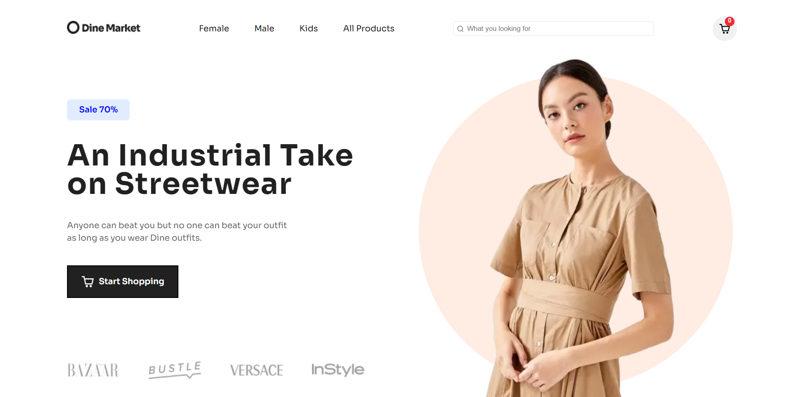
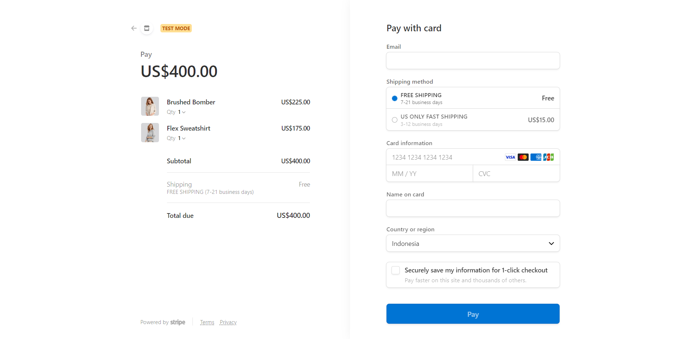
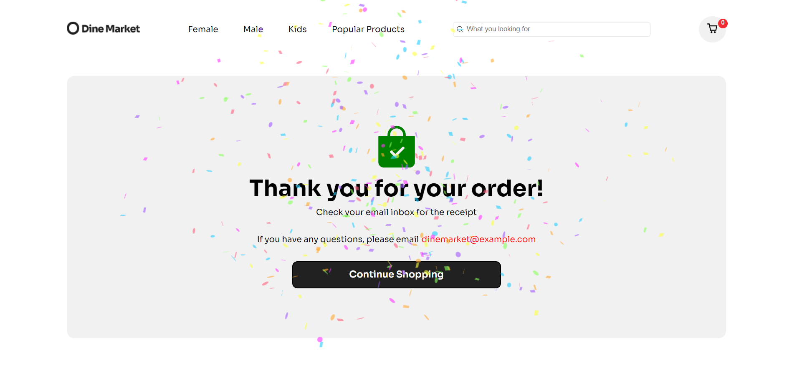

# Full Stack E-Commerce Clothing Website
This project is a full stack e-commerce website created with Next js. I created this project as an exercise to develop my web development skills, especially to learn about Next js

## Table of contents

- [Overview](#overview)
  - [The challenge](#the-challenge)
  - [Screenshot](#screenshot)
  - [Links](#links)
- [My process](#my-process)
  - [Built with](#built-with)
  - [What I learned](#what-i-learned)
  - [Continued development](#continued-development)
  - [Useful resources](#useful-resources)
- [Author](#author)
- [Acknowledgments](#acknowledgments)


## Overview

### The challenge

- Build out the project to the designs provided
- Connecting to Sanity as back end database for e-commerce
- Connecting Stripe APIs to power online payment processing for e-commerce

### Screenshot


### Links
The live site has not been published yet
- [Live Site URL](not yet)

### Credit
[Figma Web Design & UI kit i used for this project is design by Weird Design Studio](https://ui8.net/ui-market/products/e-commerce-ui-website-design?status=7)

## My process

### Built with

- Semantic HTML5 markup
- CSS custom properties
- Flexbox
- CSS Grid
- [Next JS](https://nextjs.org/) - React Framework for Production
- [React JS](https://reactjs.org/) - JS library for building UI
- [Sanity](https://www.sanity.io/) - Sanity is a customizable solution that treats content as data to power digital business.
- [Stripe](https://stripe.com/en-gb-us) - APIs to power online payment processing for e-commerce
- [react-hot-toast](https://react-hot-toast.com/) - 
- [react icons](https://react-icons.github.io/react-icons/) - JS library to add icons
- [swiper js](https://swiperjs.com/) - JS library to add slider component
- [canvas-confetti](https://www.npmjs.com/package/canvas-confetti) - JS library to add confetti as a style 

### What I learned

I learned an easy way to add slider function in product section using swiper js library. And add text as a background in the features and newsletter section as shown below


Code snippets, see below:
```js
empty for now
```



If you want more help with writing markdown, we'd recommend checking out [The Markdown Guide](https://www.markdownguide.org/) to learn more.


### Continued development
The project is still under development

### Useful resources
- [UI/UX Design Resources](https://ui8.net/) - This website provide many UI/UX design, some are even free.
- [Tutorial Modern Full Stack ECommerce React Application with Stripe by JavaScript Mastery](https://www.youtube.com/watch?v=4mOkFXyxfsU&t=10459s) - This youtube tutorial really helps in understanding Next js and the use of sanity and stripe for e-commerce
- [Swiper React Components](https://swiperjs.com/react#styles)
- [Customize Prev/Next Button of Swiper Arrows](https://www.timo-ernst.net/blog/2020/09/12/arrows-in-react-swiper-js-how-to-customize-prev-next-button/)


## Author

- Github - [Shabrina Putri](https://github.com/shabrina12/)
- Instagram - [@shabputri_](https://www.twitter.com/yourusername)


## Acknowledgments

A HUGE Thanks to Javascript Mastery youtube channel which really helps me in learning about web development. I recommend this channel to everyone who wants to learn about web development and javascript


## Getting Started

To run the development server:

```bash
npm run dev
```

## Deploy on Vercel

The easiest way to deploy your Next.js app is to use the [Vercel Platform](https://vercel.com/new?utm_medium=default-template&filter=next.js&utm_source=create-next-app&utm_campaign=create-next-app-readme) from the creators of Next.js.

Check out our [Next.js deployment documentation](https://nextjs.org/docs/deployment) for more details.
